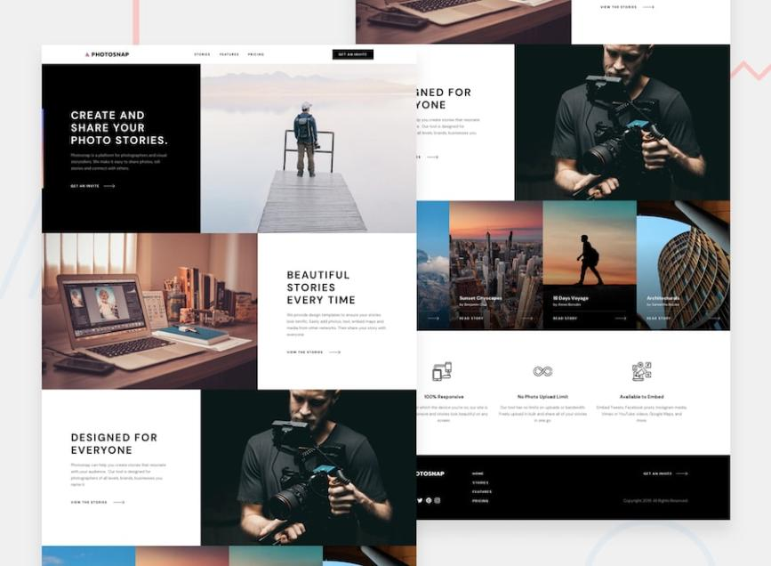

## Overview

This repository contains the source code and documentation for [colab_007], This project consists of 4 pages, each page contains: a header, several sections and a footer.

To use this project, follow these steps:

1.Clone the repository to your local machine.
2.Install the required dependencies using npm install.
3.Create a new file called .env in the root directory and set the required environment variables.
4.Run the application using npm start.
5.Open your web browser and navigate to http://localhost:3000 to access the application.

The primary goal of this project is The purpose of this project is to deepen our knowledge in the programming languages ​​in which this project is implemented and also to learn work as a team.

This README file provides an overview of the project, how to get started with it, and how to contribute. For more detailed documentation on specific aspects of the project, please refer to the [https://github.com/levaniakobidze/colab_007].

### The challenge

Users should be able to:

- View the optimal layout for the app depending on their device's screen size
- See hover states for all interactive elements on the page

### Screenshot

### Links

- Solution URL: [https://github.com/levaniakobidze/colab_007]
- Live Site URL: [https://chimerical-panda-c01cba.netlify.app/home.html]

### Built with

- Semantic HTML5 markup
- CSS custom properties
- Flexbox
- CSS Grid
- Mobile-first workflow
- javascript

### What I learned

Through this project, I deepened my knowledge in HTML, CSS, JavaScript and GitHub.
And I also learned to work as a team

## Author

- Website - [giorgi khoshtaria,nino kvakhadze,levan papava](https://github.com/levaniakobidze/colab_007)
- Frontend Mentor - [@levan iakobidze](https://github.com/levaniakobidze)
